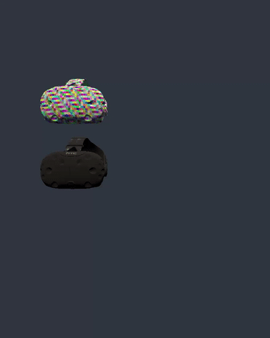
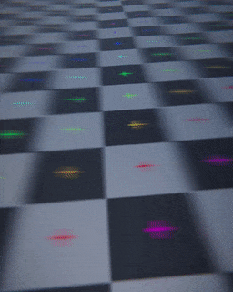

# Unity-Glitch-Shader-Experiment
Glitch shader experiment.
  1. Cell division with per pixel world space position and cell shading with simplex noise.
  2. Smoothstep merged with sin opacity mask.
  3. Relative vertex offset.

  

  
